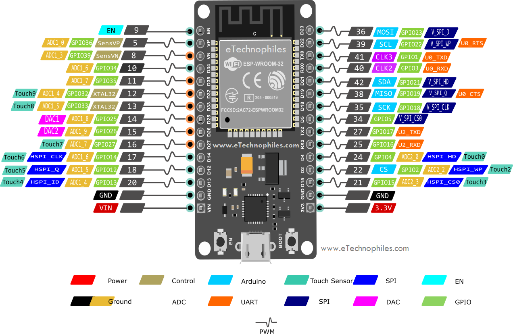

# IREsp32

## TODO
- [ ]  Cuando la página comienza añadir animación de cargando y luego de un timeout si no hay dispositivos, actualizar el UI acordemente.
- [ ] Check if the device already exists: the current function it's wrong (will not work).
- [ ] Should auto detect slaves when the master is rebooted/reconnected. Currently if slaves are active and the slave restarts then the slave won't connect back with the slaves.

## Problems
- List of devices in MASTER are not updated when one it's disconnected. Possible fix: do a round robin of checking every 1sec?
- Just two commands for the time being (per device).
- Many things are hard coded in the firmware (device data, commands, network data, websocket server).
- Should really think of the logic for connecting devices, is it better to have an ESP32 to be a hotspot? or just to connect to the LAN? if LAN: how does one configure it (LAN data SSID and PASSWORD)?
- When the master disconnects the rest the slave won't connect back again.
### Problems with IR
- Special devices require more sofisticated IR blasting (AC not working wih NEC).

## Documentation

## Dependencies
- [Arduino-IRremote](https://github.com/Arduino-IRremote/Arduino-IRremote?tab=readme-ov-file#receiving-ir-codes)
- [ESPAsyncTCP](https://github.com/dvarrel/ESPAsyncTCP)
- [Arduino-WebSockets](https://github.com/Links2004/arduinoWebSockets)

## Board pinout (i think this is it)

## Contributors

- [Tomás Vidal](@TomiVidal99)